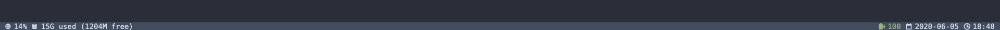

# Clockbar

A simple bar with minimal information for [Übersicht](https://github.com/felixhageloh/uebersicht) on macOS.

Based on [Bar](https://github.com/callahanrts/bar).

* CPU usage
* Memory usage
* Battery
* Date
* Time

On the left, the bar shows CPU and memory usage.
On the right side, it shows battery status (including whether it is charging), date, and time.

## Installation

**Requires `DejaVuSansMono Nerd Font` in order to display the icons.**
You can also install and set a different Nerd Font in `./index.jsx`.

Download (or clone) this repository and place the folder in your Übersicht widgets directory.

That is usually `/Users/<username>/Library/Application Support/Übersicht/widgets/`.

## Configuration

Check `./index.jsx`, it is pretty simple.
The `command` greps/awks all the relevant info and outputs it into a serialized JSON.
The `result` method is used to access data in the JSON.
